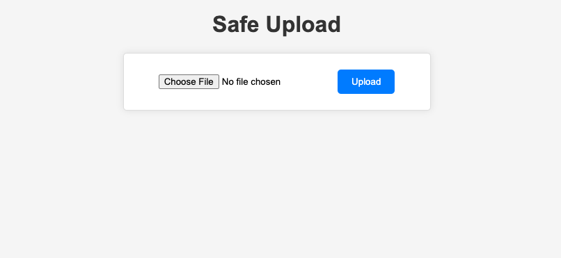

<!-- ABOUT THE PROJECT -->
## About The Project

Develop a web-based Node.js application that allows secure and reliable file uploads to Azure Blob Storage.

## Purpose of the Project

The purpose of this project is to gain a deeper understanding of Azure storage, encompassing containers and blob storage, and to seamlessly integrate Azure Storage SDK into my Node.js application. This project incorporates the following key achievements:

* Deployment of a Node.js application to Azure Web Apps.

* The use of Infrastructure-as-Code (Terraform) for the creation of Azure storage resources.

* Effective utilization of Azure Storage SDK within my Node.js application.

* Integration of Azure Key Vault, encompassing the comprehension of roles and policies, for enhanced security. This approach ensures that sensitive information is not hard-coded within the codebase, thereby eliminating the need for .env files.

* Implementation of Azure Monitor services for proactive monitoring, ensuring the reliability and performance of the application.

## Implementation Plan

### Built With

This project consisted of the following services

 

<!-- GETTING STARTED -->
## Getting Started

These steps outline the general approach I took to complete this project. While not providing an in-depth look into each step, they serve as a valuable starting point for anyone looking to initiate a similar project.

### Step 1: 

## Key Takeaways

## Next Steps and Future Improvements

